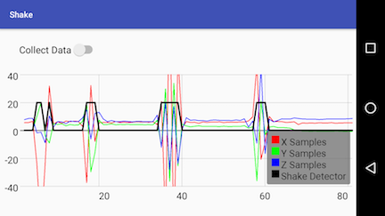

# Shake  

This is a toy Android application I used get some experience with:  
* Kotlin with Android  
* Android's accelerometer  
* [GraphView library](http://www.android-graphview.org/)  
* Writing data to a file that can be uploaded from the Android device for analysis

The app obtains accelerometer sensor data and plots the X,Y,Z acceleration components along with a shake detector signal which rises to a "shake state" when the device is subjected to an acceleration of more than 2 gs.

The shake detect signal is computed using a high-pass filter approximation which subtracts the average of each accleration component from every new sample. The Y-axis units are g's and do correspond to the acceleration components.    

The detector signal clamps to 20g's when a shae is detected. (The magnitude of the shake signal is just a set level.)

Here is a picture:  
 

## Technologies  

Accelerometer sensor reading is covered by Android documentation.  
  
See [GraphView library](http://www.android-graphview.org/) for information on the graphing library.    

The data file created by the app is written to the app's storage. I used [Handshaker](http://www.teamandroid.com/2017/03/19/handshaker-android-files-transfer-mac/) to upload the signal data to my Mac to play with filtering algorithms.

